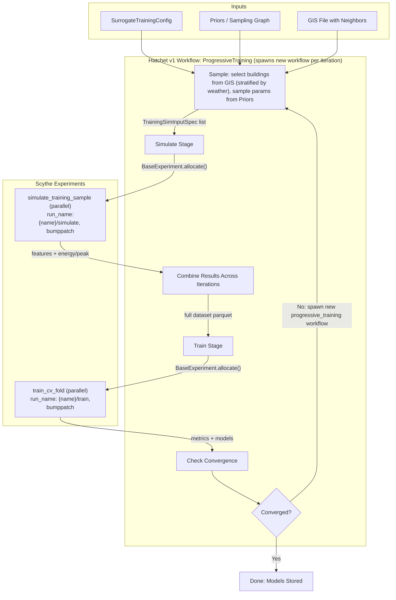

# Port Surrogate Training Pipeline to GloBI

## Context and Goal

Port `epengine/models/train_sbem.py` and `epengine/workflows/train_sbem.py` into `src/globi/`, adapting the progressive surrogate training pipeline to use:

- `**FlatModel**` (from epinterface) instead of the old DB + component map + semantic fields approach
- **Externalized sampling graphs** (`Priors`) as pipeline inputs, with terminal nodes mapping directly to FlatModel field names
- **GIS file** as source of building geometry (width, depth, rotation, num_floors) and neighbor shading -- only f2f_height, wwr, and all non-geometric parameters are sampled from priors
- **Scythe experiments** for embarrassingly parallel stages (simulation, CV fold training), using Scythe's automatic S3 key management and scatter/gather
- **Hatchet v1 workflows** for sequential orchestration (the progressive training outer loop), spawning new workflows per iteration

## Architecture Overview




---

## Resolved Design Decisions

### 1. Geometry Comes from GIS, Not Sampling Ranges

Building geometry (width, depth, rotation, num_floors) and neighbor shading geometry come from a **real preprocessed GIS file**. The sampling stage:

1. Loads the preprocessed GIS GeoDataFrame (already has rotated rectangles, neighbor polys/heights/floors from `[preprocess_gis_file](src/globi/pipelines.py)`)
2. Stratifies buildings by weather file
3. Randomly selects `n` buildings (stratified-equal sampling per weather file stratum)
4. Uses each selected building's **actual** width, depth, rotation, num_floors, neighbor_polys, neighbor_heights, neighbor_floors
5. Samples **only** f2f_height, wwr, and all non-geometric FlatModel parameters (envelope, HVAC, schedules, etc.) from the `Priors` graph

This means the distribution of shading patterns is approximately accurate at the weather-file level, matching the old epengine approach.

### 2. Stratification by Weather File

Same as old pipeline. Each iteration samples `n` buildings from the GIS file, stratified by weather file (equal sampling per stratum). The weather file column is already present in the preprocessed GIS data.

### 3. Prior Terminal Nodes = FlatModel Field Names

The `Priors` dependency graph has terminal nodes that correspond directly to `FlatModel` constructor kwargs (e.g. `FacadeCavityInsulationRValue`, `HeatingSystemCOP`, `WWR`, `F2FHeight`). A simple tree with one independent prior per parameter (all `UnconditionalPrior` with no dependencies) is a valid and easy starting point. Future TODO: add validation that all required FlatModel fields appear as terminal nodes in the priors graph.

### 4. Spawn New Workflows Per Iteration + Scythe bumppatch Versioning

Each progressive training iteration spawns a **new** Hatchet workflow. Scythe experiments use consistent `run_name` values with `bumppatch` versioning, eliminating the need for a manual iteration counter:

- Simulation experiments: `run_name="{name}/simulate"`, `version="bumppatch"`
  - Iteration 0: `{BUCKET_PREFIX}/{name}/simulate/v1.0.0/{timestamp}/...`
  - Iteration 1: `{BUCKET_PREFIX}/{name}/simulate/v1.0.1/{timestamp}/...`
  - Iteration 2: `{BUCKET_PREFIX}/{name}/simulate/v1.0.2/{timestamp}/...`
- Training experiments: `run_name="{name}/train"`, `version="bumppatch"`
  - Iteration 0: `{BUCKET_PREFIX}/{name}/train/v1.0.0/{timestamp}/...`
  - Iteration 1: `{BUCKET_PREFIX}/{name}/train/v1.0.1/{timestamp}/...`

To determine the current iteration index at runtime, we can call `BaseExperiment.list_versions()` and count existing versions.

### 5. Deterministic Pipeline Left As-Is

No changes to the existing deterministic simulation pipeline in `[pipelines.py](src/globi/pipelines.py)` beyond the `feature_dict` / `INDEX_COLS_TO_KEEP` cleanup.

### 6. Scythe vs Hatchet: When to Use Which

- **Scythe experiments** for: simulation of training samples (embarrassingly parallel, each `FlatModel` sim is independent, results aggregated by Scythe into `final/` S3 layout) and training fold execution (each fold trains independently).
- **Hatchet v1 workflows** for: the progressive training orchestration loop (sample -> simulate -> train -> check convergence -> iterate), which is sequential and stateful.
- Inside the Hatchet workflow tasks, we call `BaseExperiment.allocate()` to trigger Scythe experiments and poll/await their completion. Scythe handles all scatter/gather, S3 upload, and result merging automatically via `RecursionMap`.

### 7. FlatModel + Neighbor Geometry in epinterface

The new `FlatModel` in epinterface handles building simulation but currently has no neighbor shading support. Two changes are needed in the **epinterface submodule**:

- `**[builder.py](submodules/epinterface/epinterface/sbem/builder.py)` `Model.run()**`: Add optional `neighbor_polys`, `neighbor_heights`, `neighbor_f2f_height` params. When provided, call `prepare_neighbor_shading_for_idf` and `match_idf_to_building_and_neighbors` inside `build()` (the same logic currently in `[globi/pipelines.py](src/globi/pipelines.py)` lines 127-158).
- `**[flat_model.py](submodules/epinterface/epinterface/sbem/flat_model.py)` `FlatModel.simulate()**`: Add optional neighbor geometry params and forward to `Model.run()`.

This keeps `FlatModel` fields flat (no neighbor geometry stored on the model) while enabling simulation with neighbors.

### 8. Redesign of `feature_dict`

The current `[feature_dict](src/globi/models/tasks.py)` on `GloBIBuildingSpec` (lines 192-265) is problematic:

- It manually builds a `dict[str, str | int | float]` with string keys like `"feature.geometry.long_edge"`
- It mixes concerns: deterministic computed properties (shading mask, orientation trig), raw field access, and random sampling (`basement_use_fraction`, `attic_height` use `np.random.uniform` inside `cached_property`)
- It is only used in one place (`[pipelines.py` line 180](src/globi/pipelines.py)) as `additional_index_data` for `make_multiindex`
- `INDEX_COLS_TO_KEEP` (lines 62-76) is defined but never referenced

**Proposed redesign:**

1. **Remove `feature_dict**` from `GloBIBuildingSpec` entirely
2. **Remove `INDEX_COLS_TO_KEEP**` from `pipelines.py`
3. **Add a `feature_dict()` method to `FlatModel**` in epinterface that returns all its fields as a flat dict (this is natural since FlatModel *is* the flat parameter set). It can optionally accept neighbor geometry to compute and include shading mask values.
4. **For the deterministic pipeline** (`pipelines.py`), stop passing `additional_index_data=spec.feature_dict` and instead rely on Scythe's automatic `model_dump`-based multi-indexing from `make_multiindex()`.
5. **For the surrogate pipeline**, features come naturally from `FlatModel.feature_dict()` + shading mask.

### 9. Multi-Column ConditionalPrior

The current approach to conditioning on multiple columns requires:

1. First creating a `ConcatenateFeaturesSampler` to produce a compound key (e.g. `"SFH.pre_1975"`)
2. Then creating a `ConditionalPrior` that matches on that compound key string

This pollutes the feature namespace with synthetic `feature.compound.*` columns. Instead, we add a `**MultiColumnConditionalPrior**` that conditions directly on tuples of column values:

```python
class MultiColumnCondition(BaseModel):
    match_vals: tuple[str | float | int | bool, ...]
    sampler: PriorSampler

class MultiColumnConditionalPrior(BaseModel, PriorABC):
    source_features: list[str]
    conditions: list[MultiColumnCondition]
    fallback_prior: PriorSampler | None

    def sample(self, context, n, generator):
        # Build row-wise tuples from source_features columns
        # Match each row's tuple against conditions
        # Apply matching sampler per row, fallback for unmatched
```

This eliminates the need for `ConcatenateFeaturesSampler` + compound key columns entirely. The `depends_on` property returns the set of `source_features`. Note: `ConcatenateFeaturesSampler` is retained for backward compatibility, but new code should prefer `MultiColumnConditionalPrior`.

### 10. Referenceable Configs

Following the existing pattern in `[configs.py](src/globi/models/configs.py)`, training configs use the `BaseConfig` + `Annotated[..., BeforeValidator(...)]` pattern so they can be provided as inline dicts, local YAML paths, or remote URIs (S3/HTTP).

---

## Detailed File Changes

### Phase 1: Copy and enhance the sampling module

**Copy `[epengine/models/sampling.py](submodules/epengine/epengine/models/sampling.py)` -> `src/globi/models/sampling.py**`

The module is self-contained (depends only on networkx, numpy, pandas, pydantic). Changes:

- Fix the NaN bug on line 429: `if (final == np.nan).any()` -> `if np.isnan(final).any()`
- Add `MultiColumnCondition` and `MultiColumnConditionalPrior` classes
- Add `MultiColumnConditionalPrior` to the `Prior` union type
- Add `networkx` to `[pyproject.toml](pyproject.toml)` dependencies

The `MultiColumnConditionalPrior` implementation:

```python
class MultiColumnCondition(BaseModel):
    """A condition that matches on multiple source features simultaneously."""
    match_vals: tuple[str | float | int | bool, ...]
    sampler: PriorSampler

class MultiColumnConditionalPrior(BaseModel, PriorABC):
    """A conditional prior that conditions on multiple source features."""
    source_features: list[str]
    conditions: list[MultiColumnCondition]
    fallback_prior: PriorSampler | None

    @model_validator(mode="after")
    def validate_condition_lengths(self):
        for c in self.conditions:
            if len(c.match_vals) != len(self.source_features):
                raise ValueError(...)
        return self

    def sample(self, context: pd.DataFrame, n: int, generator: np.random.Generator):
        row_tuples = list(zip(*(context[f].to_numpy() for f in self.source_features)))
        conditional_samples = {
            c.match_vals: c.sampler.sample(context, n, generator)
            for c in self.conditions
        }
        final = np.full(n, np.nan)
        any_matched = np.full(n, False)
        for match_vals, samples in conditional_samples.items():
            mask = np.array([t == match_vals for t in row_tuples])
            any_matched |= mask
            final = np.where(mask, samples, final)
        if self.fallback_prior is not None:
            final = np.where(~any_matched, self.fallback_prior.sample(context, n, generator), final)
        if np.isnan(final).any():
            raise SamplingError(...)
        return final

    @property
    def depends_on(self) -> set[str]:
        return set(self.source_features) | {
            dep for c in self.conditions for dep in c.sampler.depends_on
        }
```

### Phase 2: Redesign feature handling

**Modify `[src/globi/models/tasks.py](src/globi/models/tasks.py)**`

- Remove `feature_dict` property from `GloBIBuildingSpec`
- Remove `from epinterface.geometry import compute_shading_mask` import (no longer needed here)

**Modify `[src/globi/pipelines.py](src/globi/pipelines.py)**`

- Remove `INDEX_COLS_TO_KEEP` (unused)
- Update `simulate_globi_building_pipeline` to stop passing `additional_index_data=spec.feature_dict` to `make_multiindex`. Instead, rely on the default `model_dump`-based indexing from Scythe's `ExperimentInputSpec.make_multiindex()`.

**Modify `[submodules/epinterface/epinterface/sbem/flat_model.py](submodules/epinterface/epinterface/sbem/flat_model.py)**`

- Add a `feature_dict(neighbor_polys=None, neighbor_heights=None)` method that returns all FlatModel fields as a flat `dict[str, str | int | float]`, optionally including shading mask values computed from neighbor geometry via `compute_shading_mask`.
- This becomes the canonical way to extract ML-ready features from a FlatModel.

### Phase 3: Add neighbor geometry support to epinterface

**Modify `[submodules/epinterface/epinterface/sbem/builder.py](submodules/epinterface/epinterface/sbem/builder.py)**`

- Add optional `neighbor_polys: list[str] | None`, `neighbor_heights: list[float | int | None] | None`, `neighbor_f2f_height: float | None` parameters to `Model.run()`
- When provided, compute shading via `prepare_neighbor_shading_for_idf` and apply via `match_idf_to_building_and_neighbors` inside `build()`, composing with any existing `post_geometry_callback`
- This consolidates the neighbor handling currently done manually in `[globi/pipelines.py](src/globi/pipelines.py)` lines 127-158

**Modify `[submodules/epinterface/epinterface/sbem/flat_model.py](submodules/epinterface/epinterface/sbem/flat_model.py)**`

- Add optional neighbor geometry params to `FlatModel.simulate()` and forward to `Model.run()`
- `FlatModel.to_model()` now also returns the building's rotated rectangle polygon (computed from Width, Depth, Rotation) so callers can use it for shading mask computation

### Phase 4: Create surrogate training models

**New file: `src/globi/models/surrogate.py**`

All training configuration models, using the `BaseConfig` pattern for YAML/URI loading:

```python
class ConvergenceThresholds(BaseConfig):
    mae: float | None = None
    rmse: float | None = None
    mape: float | None = None
    r_squared: float | None = None
    cvrmse: float | None = None
    def check(self, metrics: dict[str, float]) -> bool: ...

class TrainingHyperparameters(BaseConfig):
    num_leaves: int = 31
    max_depth: int = -1
    learning_rate: float = 0.1
    n_estimators: int = 100
    ...

class CrossValidationSpec(BaseConfig):
    n_folds: int = 5

class IterationSpec(BaseConfig):
    n_init: int = 1000
    n_per_iter: int = 500
    max_iters: int = 10

class SurrogateTrainingConfig(BaseConfig):
    name: str  # e.g. "mysurrogate" -- used as Scythe run_name prefix
    priors_file: FileReference  # YAML containing serialized Priors graph
    gis_file: FileReference  # Preprocessed GIS parquet with neighbors
    gis_preprocessor_config: ReferencedGISPreprocessorConfig  # For GIS preprocessing if needed
    convergence: ReferencedConvergenceThresholds
    hyperparameters: ReferencedTrainingHyperparameters
    cv: ReferencedCrossValidationSpec
    iteration: ReferencedIterationSpec
```

Note: No `geometry_ranges` needed since geometry comes from GIS. The `gis_file` should already be preprocessed (with rotated rectangles, neighbors, weather file assignments). If raw GIS is provided, `gis_preprocessor_config` can be used to preprocess it first.

**Scythe Input/Output specs:**

```python
class TrainingSimInputSpec(ExperimentInputSpec):
    """Input for a single training simulation."""
    flat_model_params: dict[str, Any]  # All FlatModel constructor kwargs
    epw_uri: FileReference
    # Geometry from GIS (not sampled from priors)
    rotated_rectangle: str  # WKT polygon
    long_edge: float
    short_edge: float
    long_edge_angle: float
    num_floors: int
    # Neighbor geometry from GIS
    neighbor_polys: list[str] = Field(default_factory=list)
    neighbor_heights: list[float | int | None] = Field(default_factory=list)
    neighbor_floors: list[float | int | None] = Field(default_factory=list)

class TrainingSimOutputSpec(ExperimentOutputSpec):
    """Output: Scythe auto-manages dataframes dict."""
    # dataframes will contain "Features" and "EnergyAndPeak"

class TrainFoldInputSpec(ExperimentInputSpec):
    """Input for a single CV fold training."""
    data_uri: FileReference  # S3 URI to combined training data parquet
    fold_index: int
    n_folds: int
    hyperparameters: TrainingHyperparameters
    feature_columns: list[str]
    target_columns: list[str]
    stratification_column: str = "weather_file"

class TrainFoldOutputSpec(ExperimentOutputSpec):
    """Output: model file refs + metrics in dataframes."""
    # dataframes: {"GlobalMetrics": ..., "StratumMetrics": ...}
```

### Phase 5: Create Scythe experiments for parallel stages

**New file: `src/globi/surrogate/__init__.py**`

**New file: `src/globi/surrogate/experiments.py**`

Two Scythe experiments registered via `@ExperimentRegistry.Register`:

```python
@ExperimentRegistry.Register(retries=2, schedule_timeout="10h", execution_timeout="30m")
def simulate_training_sample(
    input_spec: TrainingSimInputSpec, tempdir: Path
) -> TrainingSimOutputSpec:
    # 1. Build FlatModel from flat_model_params
    #    (Width/Depth/NFloors/Rotation come from GIS via the spec,
    #     but are also in flat_model_params since FlatModel needs them)
    flat_model = FlatModel(**input_spec.flat_model_params)
    # 2. Simulate with neighbor geometry from GIS
    result = flat_model.simulate(
        eplus_parent_dir=tempdir,
        neighbor_polys=input_spec.neighbor_polys,
        neighbor_heights=input_spec.neighbor_heights,
    )
    # 3. Extract features (all FlatModel fields + shading mask)
    features_dict = flat_model.feature_dict(
        neighbor_polys=input_spec.neighbor_polys,
        neighbor_heights=input_spec.neighbor_heights,
    )
    features_df = pd.DataFrame([features_dict])
    # 4. Extract energy/peak results
    energy_and_peak = result.energy_and_peak.to_frame().T
    return TrainingSimOutputSpec(
        dataframes={"Features": features_df, "EnergyAndPeak": energy_and_peak}
    )

@ExperimentRegistry.Register(retries=1, schedule_timeout="2h", execution_timeout="1h")
def train_cv_fold(
    input_spec: TrainFoldInputSpec, tempdir: Path
) -> TrainFoldOutputSpec:
    # 1. fetch_uri to load combined data parquet
    # 2. Stratified k-fold split by weather_file, select this fold
    # 3. Train LightGBM models per target column
    # 4. Compute metrics (MAE, RMSE, R2, CVRMSE, MAPE) globally and per stratum
    # 5. Save .lgb models as FileReference outputs
    # 6. Return TrainFoldOutputSpec with metrics dataframes
```

### Phase 6: Create GIS-based sampling logic

**New file: `src/globi/surrogate/sampling.py**`

The core sampling function that merges GIS geometry with priors-based parameter sampling:

```python
def sample_training_specs(
    gis_gdf: gpd.GeoDataFrame,
    priors: Priors,
    n: int,
    iteration_spec: IterationSpec,
    generator: np.random.Generator,
) -> list[TrainingSimInputSpec]:
    """Sample training specs by selecting buildings from GIS and
    sampling FlatModel parameters from priors.

    Flow:
    1. Stratify GIS buildings by weather file column
    2. Sample n buildings (equal per stratum, with replacement)
    3. For each selected building, extract geometry:
       - width (short_edge), depth (long_edge), rotation (long_edge_angle)
       - num_floors
       - neighbor_polys, neighbor_heights, neighbor_floors
       - weather file URI
    4. Build context DataFrame with GIS-derived columns
    5. Call priors.sample(context, n, generator) to fill in:
       - F2FHeight, WWR
       - All envelope params (FacadeCavityInsulationRValue, etc.)
       - All HVAC params (HeatingSystemCOP, etc.)
       - All schedule params (EquipmentBase, etc.)
       - All other FlatModel fields governed by the priors
    6. Construct TrainingSimInputSpec per row
    """
```

Key: the `Priors` graph's terminal nodes use FlatModel field names. The context DataFrame initially contains GIS-derived columns (which the priors may read as fixed context, e.g. for conditional priors that depend on weather file or building typology). The priors then fill in all sampled columns.

### Phase 7: Hatchet v1 workflow for progressive training

**New file: `src/globi/surrogate/workflows.py**`

Uses Hatchet v1 SDK via `from scythe.hatchet import hatchet`:

```python
from pydantic import BaseModel
from scythe.hatchet import hatchet

class ProgressiveTrainingInput(BaseModel):
    config_uri: str  # URI to SurrogateTrainingConfig YAML

progressive_training = hatchet.workflow(
    name="progressive_surrogate_training",
    input_validator=ProgressiveTrainingInput,
)

@progressive_training.task()
async def sample_and_simulate(input: ProgressiveTrainingInput, ctx: Context):
    # 1. Load SurrogateTrainingConfig via fetch_uri
    # 2. Load Priors from config.priors_file
    # 3. Load or preprocess GIS file
    # 4. Determine n for this iteration (n_init or n_per_iter)
    # 5. Call sample_training_specs() to generate TrainingSimInputSpec list
    # 6. Create BaseExperiment(
    #        experiment=simulate_training_sample,
    #        run_name=f"{config.name}/simulate"
    #    )
    # 7. experiment.allocate(
    #        specs, version="bumppatch",
    #        recursion_map=RecursionMap(factor=branching_factor, max_depth=1)
    #    )
    # 8. Poll/await completion
    # 9. Retrieve results from experiment.latest_results
    # 10. Combine with previous iteration data (if any) and upload combined dataset
    # 11. Return {"combined_data_uri": ..., "sim_version": ...}

@progressive_training.task(parents=[sample_and_simulate])
async def train_with_cv(input: ProgressiveTrainingInput, ctx: Context):
    # 1. Get combined data URI from parent task output
    # 2. Create TrainFoldInputSpec for each of n_folds
    # 3. Create BaseExperiment(
    #        experiment=train_cv_fold,
    #        run_name=f"{config.name}/train"
    #    )
    # 4. experiment.allocate(fold_specs, version="bumppatch", ...)
    # 5. Await completion
    # 6. Retrieve fold metrics, aggregate
    # 7. Return {"metrics": ..., "model_uris": ..., "train_version": ...}

@progressive_training.task(parents=[train_with_cv])
async def check_convergence_and_iterate(input: ProgressiveTrainingInput, ctx: Context):
    # 1. Get metrics from parent task
    # 2. Load convergence thresholds from config
    # 3. Determine current iteration from sim experiment version count
    # 4. If converged or iteration >= max_iters: finalize, return success
    # 5. If not converged: spawn new progressive_training.run(input)
```

**Versioning and iteration tracking:**

- Each call to `experiment.allocate(..., version="bumppatch")` auto-increments: v1.0.0 -> v1.0.1 -> v1.0.2
- To know the current iteration: `len(sim_experiment.list_versions())` gives the count
- No manual iteration counter stored anywhere

**Combining results across iterations:**

- After each simulation experiment completes, fetch its `final/` results
- Load any previous combined dataset (from prior iterations)
- Merge into a new combined dataset and upload to a known location
- Pass URI to the training stage

### Phase 8: Result aggregation utilities

**New file: `src/globi/surrogate/postprocess.py**`

- `combine_simulation_results(previous_data: pd.DataFrame | None, new_experiment: BaseExperiment) -> pd.DataFrame` -- Fetches new results from Scythe experiment's `final/` output, concatenates with previous data
- `aggregate_fold_metrics(fold_experiment: BaseExperiment) -> tuple[pd.DataFrame, pd.DataFrame]` -- Returns (global_metrics, stratum_metrics)
- `check_convergence(metrics: pd.DataFrame, thresholds: ConvergenceThresholds) -> bool`

### Phase 9: Worker registration and dependencies

**Modify `[src/globi/worker/main.py](src/globi/worker/main.py)**`

- Add `from globi.surrogate.experiments import *` to register new Scythe experiments with the worker
- Add `from globi.surrogate.workflows import *` so Hatchet picks up the workflow

**Modify `[pyproject.toml](pyproject.toml)**`

- Add `networkx` to dependencies (for sampling module dependency graph)
- Add `lightgbm` to dependencies (for surrogate model training)

---

## Key Differences from Old epengine

- **Building model**: Old used `construct_zone_def` from DB + component map; new uses `FlatModel` with flat parameters
- **Geometry source**: Old randomly sampled buildings from GIS for geometry + neighbors; new does the same, but geometry is explicitly separated from prior-sampled parameters
- **Sampling**: Old sampled semantic fields categorically inside `SampleSpec`; new takes an externalized `Priors` dependency graph whose terminal nodes map to FlatModel field names
- **Multi-column conditioning**: Old required `ConcatenateFeaturesSampler` + synthetic compound key columns; new provides `MultiColumnConditionalPrior` that conditions on tuples of column values directly
- **Parallelism**: Old used custom `scatter_gather_recursive` Hatchet v0 workflows; new uses Scythe experiments with `BaseExperiment.allocate()` + `RecursionMap`, which handles scatter/gather and S3 automatically
- **Orchestration**: Old used Hatchet v0 multi-step workflows; new uses Hatchet v1 with `hatchet.workflow()` / `@workflow.task()` and Pydantic inputs
- **Iteration tracking**: Old managed iteration counters manually in spec objects; new uses Scythe `bumppatch` versioning -- each iteration auto-increments the version, iteration count derived from `list_versions()`
- **Feature extraction**: Old used a manual `feature_dict` on the simulation spec; new uses `FlatModel.feature_dict()` which is natural since the FlatModel *is* the flat parameter set
- **S3 layout**: Old used custom `hatchet/{experiment_id}/...` paths; new uses Scythe's automatic layout
- **Config loading**: New uses `BaseConfig` + `BeforeValidator` pattern so configs can be inline, local YAML, or remote URIs

---

## Future Work (TODO notes, not in scope now)

- **Priors validation**: Validate that the `Priors` graph's terminal nodes cover all required `FlatModel` fields, and that the graph is a valid DAG with correct dependency ordering.
- **Inference pipeline**: Port the inference pipeline from epengine, using trained LightGBM models + priors for Monte Carlo inference on real buildings.
- **Deterministic pipeline FlatModel migration**: Eventually migrate the deterministic pipeline to use `FlatModel` instead of `construct_zone_def`.
- **Neighbor geometry for inference**: The `select_prior_tree_for_changed_features` pattern for matched baseline/retrofit sampling.

