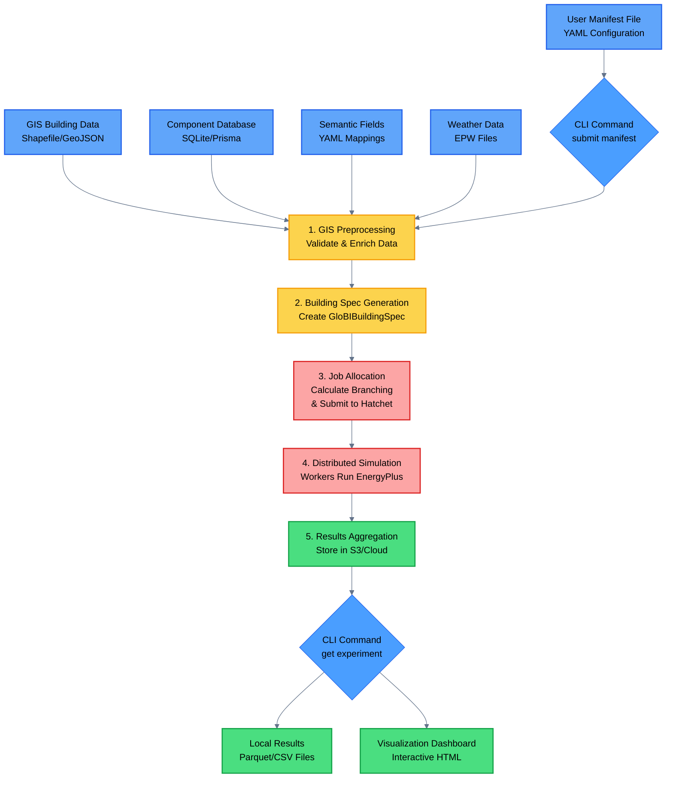

# GloBI Architecture - Simple Overview

This diagram provides a high-level overview of the GloBI (Global Building Intelligence) system workflow.

## Workflow Stages

### 1. **Input Configuration**

- **Manifest File**: YAML configuration defining the experiment, file paths, and preprocessing parameters
- **GIS Data**: Building footprints with properties (height, floors, typology)
- **Component Database**: Building components and materials specifications
- **Semantic Fields**: Mappings between building categories and properties
- **Weather Data**: EPW climate files for simulation

### 2. **GIS Preprocessing**

Validates and enriches building data:

- Filters buildings by area, height, and geometry validity
- Converts polygons to rotated rectangles
- Identifies neighboring buildings for shading analysis
- Assigns weather files based on location
- Injects semantic context (building typology, age, region)

### 3. **Building Spec Generation**

Creates structured specifications for each building:

- Extracts geometry (footprint dimensions, height, neighbors)
- Assigns building properties (WWR, basement, attic)
- Links semantic context and weather data
- Produces `GloBIBuildingSpec` objects ready for simulation

### 4. **Job Allocation**

Distributes work across compute infrastructure:

- Calculates optimal branching factor based on payload size
- Submits jobs to Hatchet workflow orchestrator
- Distributes building specs across Docker worker containers

### 5. **Distributed Simulation**

Workers execute energy simulations in parallel:

- Each worker processes assigned building specs
- Uses component database to construct EnergyPlus models
- Runs building energy simulations
- Extracts monthly energy and peak results
- Optionally captures hourly timeseries data

### 6. **Results Aggregation & Collection**

Consolidates simulation outputs:

- Aggregates results from all workers
- Stores in cloud storage (S3) as Parquet files
- Versions experiments for reproducibility
- Makes results available for retrieval

### 7. **Output & Visualization**

Delivers results to users:

- Downloads results to local filesystem
- Generates interactive D3-based dashboards
- Provides both Parquet and CSV formats
- Enables analysis of building stock energy performance

## Key Features

- **Scalability**: Processes thousands of buildings in parallel using distributed computing
- **Automation**: Minimal manual intervention from GIS data to simulation results
- **Reproducibility**: Version-controlled experiments with semantic versioning
- **Flexibility**: Configurable preprocessing, semantic mappings, and output options
- **Regional Analysis**: Designed for urban-scale building energy modeling
